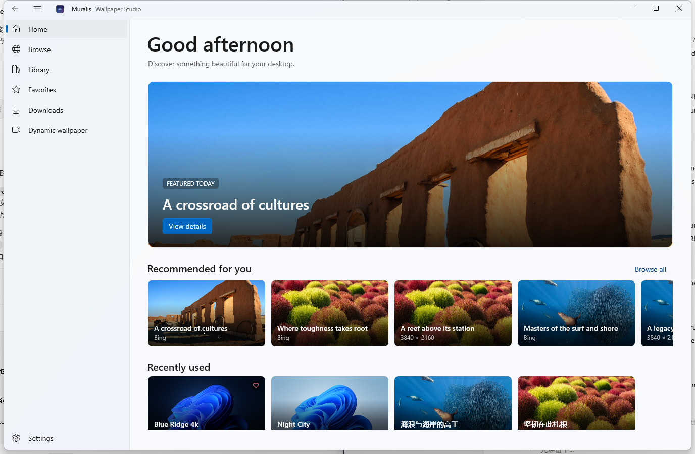
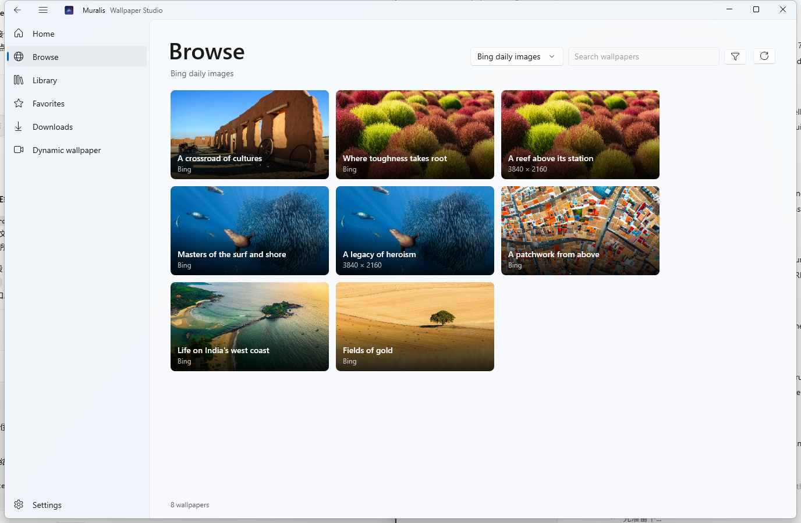
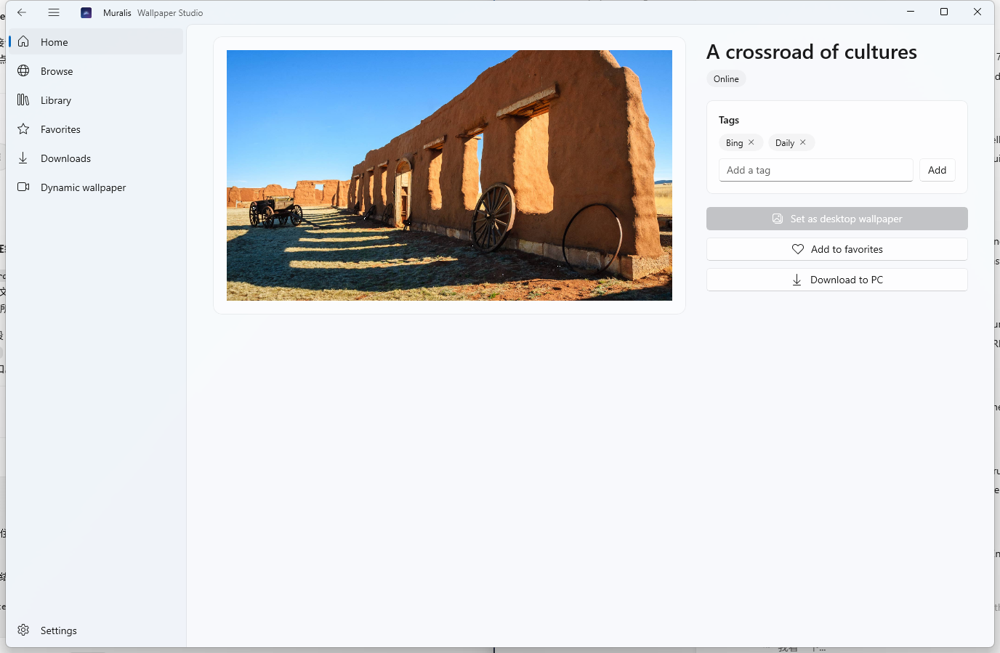
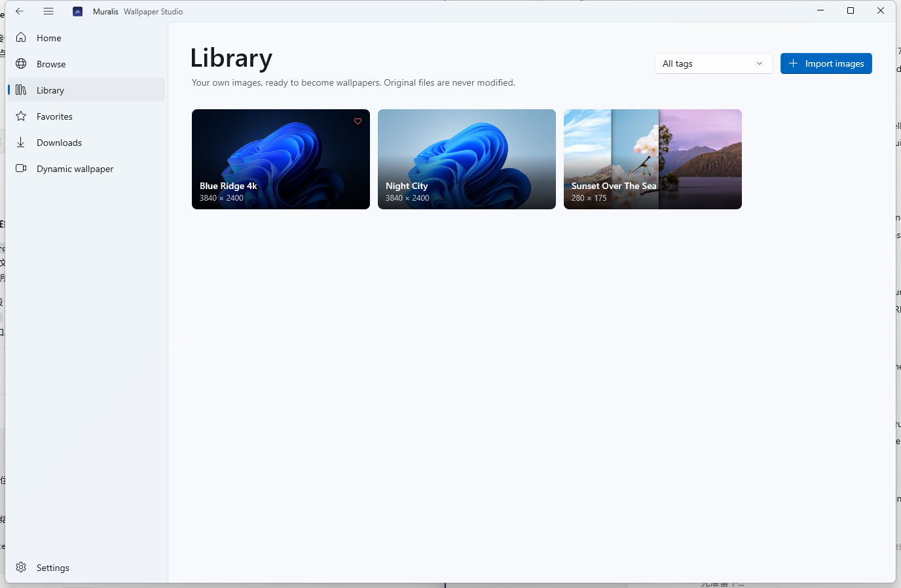
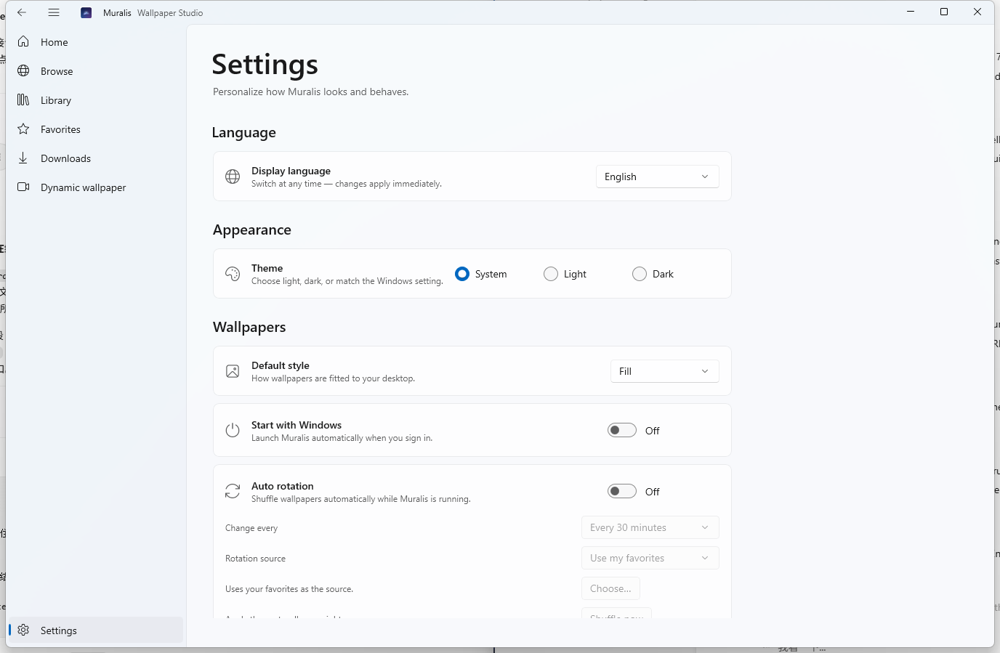
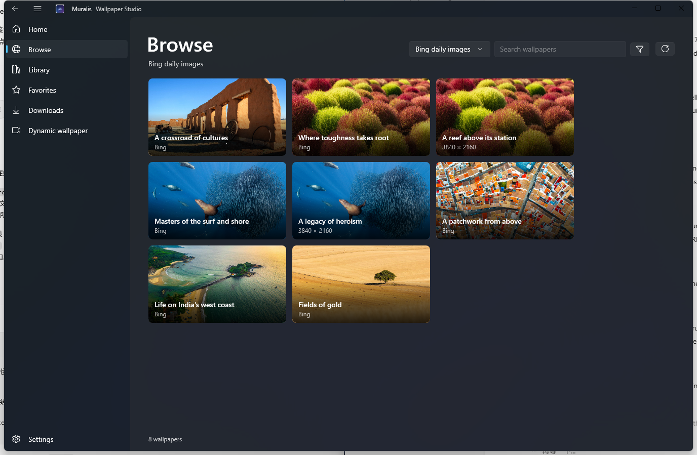

# Muralis

[](../../actions/workflows/ci.yml)
[](LICENSE)
[](https://dotnet.microsoft.com/download/dotnet/10.0)

> A modern wallpaper studio for Windows 10 & 11.

Muralis is a native Windows wallpaper manager built with WinUI 3. Browse, preview,
download, favorite and apply beautiful static wallpapers — then let Muralis rotate
them for you. Designed to feel like a first-party Windows 11 app: Mica backdrop,
Fluent controls, light/dark themes, and a clean, calm layout.

> **Status:** v0.2 — feature-complete through Milestone 3. See the [Roadmap](#roadmap).

## Features

- **Browse** — discover wallpapers in a responsive card grid with resolution, aspect ratio and tags
- **Filters** — narrow results by orientation (landscape/portrait), minimum resolution (Full HD, 2K, 4K) and, for sources that classify their wallpapers, category (general/anime/people); applied server-side where the source supports it
- **Tags** — label any wallpaper from its detail page, then filter the library by tag; tags are stored with the catalog and survive restarts
- **Multiple sources** — Bing, Wallhaven and NASA APOD (plus the samples shipped with Windows): search all of them at once or one at a time, switch sources off, and choose which one fills the Home page
- **Preview & apply** — open a wallpaper, then set it as your desktop background with one click
- **Fit modes** — Fill, Fit, Stretch, Center, Tile and Span
- **Per-display control** — pick which monitor receives a wallpaper on multi-monitor setups
- **Format friendly** — WebP and AVIF images are transcoded automatically so Windows can use them
- **Local library** — import your own images and manage them without touching the original files; duplicates are detected by content hash so the same image never enters the catalog twice
- **Favorites** — keep the ones you love, persisted across restarts
- **Downloads** — a download queue with progress, cancellation, automatic retries with growing backoff and manual retry; it keeps running while you keep browsing, and a badge on the navigation entry shows the active count
- **Update check** — the About card asks GitHub for the newest release and points you at it when a newer version exists
- **Single instance** — launching Muralis again wakes and focuses the running window instead of starting a second copy
- **Auto rotation** — shuffle favorites or a folder every 15 minutes to 24 hours
- **Dynamic wallpaper** — play a video on the desktop behind the icons: it loops, can be muted, and
  comes back automatically on the next launch if you leave it switched on. Your static wallpaper is
  never modified, so removing the video brings it straight back. A playing video survives an
  Explorer restart: Muralis re-mounts it on the rebuilt desktop layer and resumes playback
- **Runs in the tray** — close to the notification area and keep rotating; the icon re-registers
  itself when Explorer restarts; optional run at sign-in
- **English & 简体中文** — the UI follows your Windows language, or pick one in Settings; switching applies instantly
- **Light on the machine** — nothing heavy on the startup path (no network, database or
  image work before the window is up), idle CPU/GPU at ~0%, cancellable background
  loading and bounded image caches; see [docs/performance.md](docs/performance.md) for
  measured numbers
- **Native look & feel** — Mica, custom title bar, light/dark/system theme support

## Screenshots

| Home | Browse |
| --- | --- |
|  |  |

| Wallpaper details | Library |
| --- | --- |
|  |  |

| Settings | Dark theme |
| --- | --- |
|  |  |

## Requirements

- Windows 10 version 1809 (build 17763) or later / Windows 11
- Release builds are **self-contained**: no installer and no .NET runtime installation
  required. Building from source needs the [.NET 10 SDK](https://dotnet.microsoft.com/download/dotnet/10.0).

## Wallpaper sources

Each source is a plugin behind one interface (`IWallpaperProvider`), managed by a central
provider manager: enable or disable sources and pick the default one in **Settings →
Wallpaper sources**, then search a single source or all of them from Browse.

| Source | Search | API key |
| --- | --- | --- |
| Bing daily images | – | not needed |
| Wallhaven (safe-for-work only) | yes | optional |
| NASA APOD | – | required, free |
| Sample wallpapers (offline) | yes | not needed |

Keys are never hardcoded: put them in `%LOCALAPPDATA%\Muralis\providers.json` or a
`MURALIS_PROVIDER_<ID>_API_KEY` environment variable. Provider responses are cached on
disk so rate-limited APIs are not polled while browsing. See
[docs/providers.md](docs/providers.md) for key setup, caching/retry behaviour, the recipe
for adding a source, and why Unsplash/Pexels are deliberately not bundled.

## Download & Install

1. Open the [Releases page](../../releases) and download `Muralis-<version>-win-x64.zip`.
2. Extract the zip anywhere (for example `C:\Program Files\Muralis`).
3. Run `Muralis.exe`. That's it — no installer, no runtime downloads.

To upgrade, close Muralis and replace the extracted files with the newer release.

## Build from source

Prerequisites:

- [.NET 10 SDK](https://dotnet.microsoft.com/download/dotnet/10.0)
- Windows 10/11 (Developer Mode is **not** required — Muralis ships unpackaged)

```bash
git clone https://github.com/EasonMWS/Muralis.git
cd muralis
dotnet build Muralis.slnx -c Release
dotnet run --project src/Muralis.App
```

Run the tests:

```bash
dotnet test tests/Muralis.Core.Tests
```

> Tip: if `dotnet` is not on your PATH, use the SDK you installed
> (e.g. `%USERPROFILE%\.dotnet\dotnet.exe`).

## Architecture

Muralis follows a layered MVVM design with a clean separation between UI and logic:

```
Muralis.App    WinUI 3 shell — Views, ViewModels, controls, Windows platform services
Muralis.Core   Platform-agnostic domain — models, abstractions, services, providers, repositories
Muralis.DesktopHost   Win32 host that renders a video into the desktop's wallpaper layer
Muralis.Core.Tests   Unit tests for the core logic
```

- **MVVM** via CommunityToolkit.Mvvm source generators
- **Dependency injection** via Microsoft.Extensions.DependencyInjection
- **Logging** via Microsoft.Extensions.Logging + Serilog rolling file sink
- **Storage** — JSON for settings, SQLite for the wallpaper catalog (favorites, history)
- **Wallpaper API** — `IWallpaperService` abstraction; Windows implementation uses
  `SystemParametersInfo` and the `IDesktopWallpaper` COM interface
- **Providers** — `IWallpaperProvider` abstraction so new sources (Bing, Unsplash,
  Wallhaven, custom) can be plugged in without touching the app
- **Video wallpaper** — `IVideoWallpaperService` abstraction; `Muralis.DesktopHost` points a Win32
  window at the shell's wallpaper worker (the window right behind the icons), draws into a DXGI
  swap chain and feeds it from a media player in frame-server mode, on its own thread
- **Shell lifecycle** — one hidden watcher window turns Explorer restarts (`TaskbarCreated`) and
  second-launch wakes into events, so the tray icon and the video host react without shell
  knowledge leaking into their own code

## Roadmap

- [x] M1 — Project skeleton: MVVM, DI, logging, navigation, shell, four main pages
- [x] M2 — Local wallpapers: import, grid, details, set as desktop background
- [x] M3 — Persistence: favorites, history, settings (SQLite + JSON)
- [x] M4 — Online wallpapers: provider, downloads, image cache
- [x] M5 — Rotation, run-at-startup, system tray
- [x] M6 — UI polish, performance, error & memory audits
- [x] M7 — Docs, CI, release packaging
- [x] M2A — English & 简体中文 localization with live switching
- [x] M2B — Pluggable sources: Wallhaven and NASA APOD behind one provider interface
- [x] M2C — Measured performance work: startup path, thumbnails, bounded caches
- [x] M2D — Browse filters and tags, download queue, duplicate detection, update check
- [x] M3 — Dynamic wallpaper: a video plays behind the desktop icons, with shell-restart recovery
- [x] v0.2.0 hardening — single instance, Explorer restart recovery, release polish

### Later

- Video wallpaper: multiple displays, pause/seek and volume controls, HDR / 4K60 tuning
- Web wallpapers and a plugin API
- Architecture V2 — moving the desktop host and a future canvas layer into their own process
- Microsoft Store (MSIX) packaging

## Contributing

Contributions are welcome! Please read [CONTRIBUTING.md](CONTRIBUTING.md) first.

## License

[MIT](LICENSE) © Muralis Contributors

Muralis is not affiliated with Microsoft. Windows is a trademark of Microsoft Corporation.
